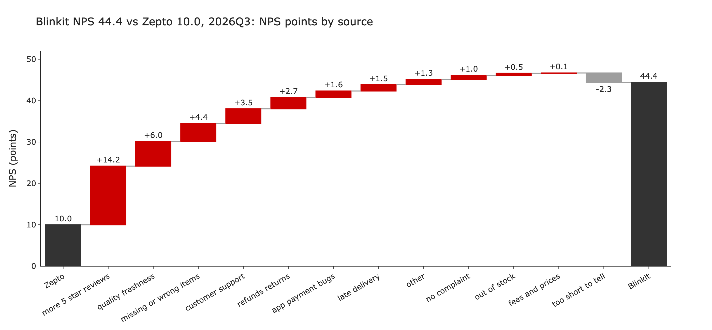
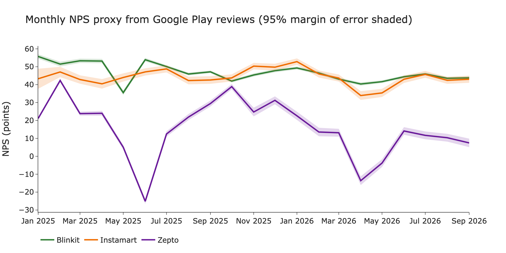

# Quick-Commerce NPS Benchmark from App Reviews

Blinkit, Zepto and Swiggy Instamart compete on speed, and their Play Store reviews are a large public record of how customers feel. This project turns every public Google Play review posted between 1 Jan 2025 and 30 Sep 2026 into a monthly NPS proxy with a 95% margin of error, tags 21,000 detractor reviews to eight complaint drivers, and prices each driver in NPS points.

In Jul to Sep 2026 Blinkit's NPS proxy is 44.4 and Zepto's is 10.0, a gap of 34.5 points. Of those, 14.2 come from Blinkit's higher share of 5 star reviews. The rest is complaints: quality and freshness 6.0 points, missing or wrong items 4.4, support and rider behaviour 3.5. Instamart (43.8) is tied with Blinkit inside the margin of error.



| App | Reviews | NPS proxy, Jul to Sep 2026 | Biggest complaint, share of tagged detractors |
|---|---|---|---|
| Blinkit | 695,428 | 44.4 (±0.5) | fees and prices, 20.8% |
| Instamart | 123,258 | 43.8 (±1.1) | fees and prices, 26.1% |
| Zepto | 294,260 | 10.0 (±1.3) | quality and freshness, 21.1% |

Swapping 3 star reviews from detractor to passive does not change the app ranking in any of the 7 quarters, and widens the Blinkit to Zepto gap from 34.5 to 36.7 points.



## Run it

```
python3.11 -m venv .venv && source .venv/bin/activate
pip install -r requirements.txt
python src/pull_reviews.py
python src/sample.py
python run_all.py
```

The pull writes about a million reviews to `data/raw/`. `run_all.py` expects the tag cache from the tagging step described below. The last step, `src/deck.py`, exports the PDF through Keynote, so it needs a Mac. The dashboard runs with `streamlit run app/streamlit_app.py`. The deck, a cover plus six slides, is in `deck/qcom_nps.pdf`.

## Method

* Promoter is 5 stars, passive is 4, detractor is 1 to 3. NPS is 100 times (share of promoters minus share of detractors). The 95% margin of error for a period is 196 times the square root of (P + D minus (P minus D) squared) over n, in NPS points.
* Reviews come from `google-play-scraper` with `lang="en"`, `country="in"`, newest first, in pages of 200. Only the review text, score, dates, thumbs up count, app version and the brand reply are kept. Usernames and pictures are never stored.
* `src/sample.py` takes the detractor reviews with 4 or more words, shuffles once with seed 42, and keeps the first 1,000 per app per quarter: 21,000 reviews. Detractors under 4 words are not tagged and form their own "too short to tell" bucket.
* Each sampled review gets one of eight complaint drivers, or `other` or `no_complaint`. The labels were assigned by Claude (Anthropic) in an interactive session, with parallel subagents that each read `labelling_rules.md` first. `src/tag_chunks.py` writes the chunk files and merges the labels into a cache.
* `src/bridge.py` splits the NPS gap between the leading and trailing app. NPS is 100 (P minus D) and D is the sum of the points lost to each driver, so the gap is the promoter difference plus each driver's difference in points lost. The bars add up to the gap exactly, and the script asserts it. The driver bars carry a sampling error of up to ±1.0 points because they rest on 1,000 tagged reviews per app and quarter.

## Validation

* Two independent tagging passes over the same 100 reviews agree on 96.0% (kappa 0.954). Each pass agrees with the main run on 92.0% and 89.0%.
* A keyword baseline (`src/keywords.py`) agrees with the model tags on 52.1% of the 21,000 reviews (kappa 0.459), so the tagging adds a lot over keyword matching.
* There are no human labels yet. Agreement between passes shows the rules are clear, not that the tags are right. `app/label.py` is a page for adding 400 hand labels, which would give accuracy against human judgement.

## Dashboard

`app/streamlit_app.py` has an app filter, a month range, the NPS trend, the driver mix and sample reviews by driver. To put it on Streamlit Community Cloud:

* Sign in at share.streamlit.io with GitHub and choose New app.
* Pick this repository, the `main` branch and `app/streamlit_app.py` as the main file.
* Under Advanced settings choose Python 3.11, then Deploy.

The cloud copy shows the 20 example quotes in `outputs/example_quotes.csv`, because the review data is not in the repository. Run it locally after the pull and the tagging for 5 sample reviews per driver.

## Data and ethics

The reviews are public. `data/` is git ignored, and no raw review text is committed. The repository holds aggregates in `outputs/` and 20 short example quotes with no names, addresses or contact details. The app logos on the deck cover are downloaded by `src/logos.py` into `data/` and are not committed.

## Limitations

* This is a review based proxy, not survey NPS. People who post reviews skew negative, so levels are not comparable with published NPS. Compare apps and periods, not absolute scores.
* Google Play and the English store only, in India. iOS and other languages are not covered.
* The tags have not been checked against human labels, and mixed reviews are labelled by the first or strongest complaint. `no_complaint` also holds vague reviews such as "worst app".
* Blinkit's lead over Instamart in Jul to Sep 2026 is 0.7 points against a margin of ±1.2, so the leader is a tie. The gap to Zepto is not.
* Instamart's first month, Jan 2025, has 903 reviews, fewer than the others.

## Related work

[dhruv-deepak/qcommerce-voice-of-customer](https://github.com/dhruv-deepak/qcommerce-voice-of-customer) counts complaints over 60 days. This project tracks NPS over 21 months and prices each complaint driver in NPS points. No code was taken from it.

## License

MIT, see `LICENSE`.
